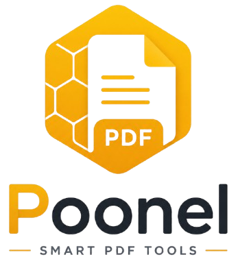

# Poonel

<p align="center">
  
</p>

<h3 align="center">
Smart PDF Tools
</h3>

---

## Philosophy

Poonel is **not** trying to become the biggest PDF application.

It is designed to become the **easiest** and most **premium** PDF utility for everyday users.

Every feature is evaluated using one simple question:

> **"Does this make PDF tasks simpler?"**

If the answer is **no**, the feature does not belong in the app.

---

# Why this project exists

Most PDF applications try to solve every possible PDF problem.

As a result they become:

- difficult to navigate
- overloaded with features
- full of technical language
- frustrating for non-technical users

Poonel takes the opposite approach.

The goal is to provide only the features people actually use, wrapped inside a clean, modern, and architectural interface.

The application is designed for everyone, including:

- First-time Android users
- Elderly users
- Users with limited technical experience
- Anyone who simply wants a professional-grade experience with zero learning curve

---

# Core Principles

- Simplicity over feature count
- One obvious action per screen
- Friendly, non-technical language
- Architectural, premium design identity
- Accessibility first
- Clean center for focus
- Large touch targets
- Consistent design system
- Predictable user experience
- Reliability before adding new features

---

# Design System (The "Poonel" Look)

Poonel features a unique **architectural geometric identity**:

- **Honey & Charcoal Palette**: A sophisticated mix of Honey Gold (`#E9A600`) and Charcoal (`#263238`).
- **Geometric Background**: An intentional, structured honeycomb network implemented in code (not images) for perfect scaling.
- **Modern Layering**: Subtle "glass" effects on top bars and cards to create depth without distraction.
- **Clean Center Focus**: Design elements are anchored to edges and corners, keeping the workspace clear for user content.

---

# Current Features

| Feature | Status |
|----------|--------|
| PDF → Images | ✅ Stable |
| Merge PDF | ✅ Stable |
| Split PDF | ✅ Stable |
| Images → PDF | ✅ Stable |

---

# Project Structure

```
com.masoudnaji.easysmartpdf

├── data
│   └── repository (PdfRenderer, MediaStore, IO logic)
│
├── domain
│   ├── model (Core entities and enums)
│   ├── repository (Interfaces)
│   └── usecase (Feature-specific logic)
│
├── ui
│   ├── components (Design System, Custom Background, Cards)
│   ├── navigation (Compose Navigation Graph)
│   ├── screens (Feature screens & ViewModels)
│   └── theme (Colors, Typography, Shapes)
│
└── util (File helpers, formatting)
```

---

# Roadmap

## Phase 1 (Completed)

✅ **Core Tools**: PDF to Images, Merge PDF, Split PDF, Images to PDF.

✅ **Design System**: Poonel Premium Branding with Geometric Background.

✅ **User Settings**: Theme (Dark/Light) and Language support.

---

## Phase 2 (Planned)

⬜ **Scanner**: High-quality document scanning.

⬜ **OCR**: Extract text from documents.

⬜ **Compress**: Reduce PDF file size.

---

## Phase 3

⬜ **Sign PDF**: Simple electronic signatures.

⬜ **Fill PDF Forms**: Easy form filling.

⬜ **Password Protection**: Encrypt documents.

---

# Tech Stack

- **Language**: Kotlin
- **UI**: Jetpack Compose & Material 3
- **Async**: Coroutines & StateFlow
- **Navigation**: Compose Navigation
- **Architecture**: MVVM + Clean Architecture layering
- **Native APIs**: PdfRenderer, MediaStore, Scoped Storage

---

# Development Principles

- **Zero Performance Impact**: Geometric backgrounds are drawn procedurally with `Canvas`.
- **Memory Efficient**: Incremental page processing for large PDFs.
- **Security**: No third-party PDF SDKs; uses native Android `PdfRenderer`.
- **Privacy**: No external servers; all processing happens locally on your device.

---

# AI-Assisted Development

This project is developed collaboratively using multiple AI assistants. Project knowledge is maintained through:

- `PROJECT_RULES.md`
- `AI_HANDOFF.md`
- `DECISIONS.md`
- `ARCHITECTURE.md`

This allows for consistent, rapid development while maintaining high code quality.

- **Privacy Policy**: [https://poonel.app/privacy](https://poonel.app/privacy)
- **Support**: [support@poonel.app](mailto:support@poonel.app)

---

# License

MIT License

---

<p align="center">

Made with ❤️ using Kotlin and Jetpack Compose

</p>
